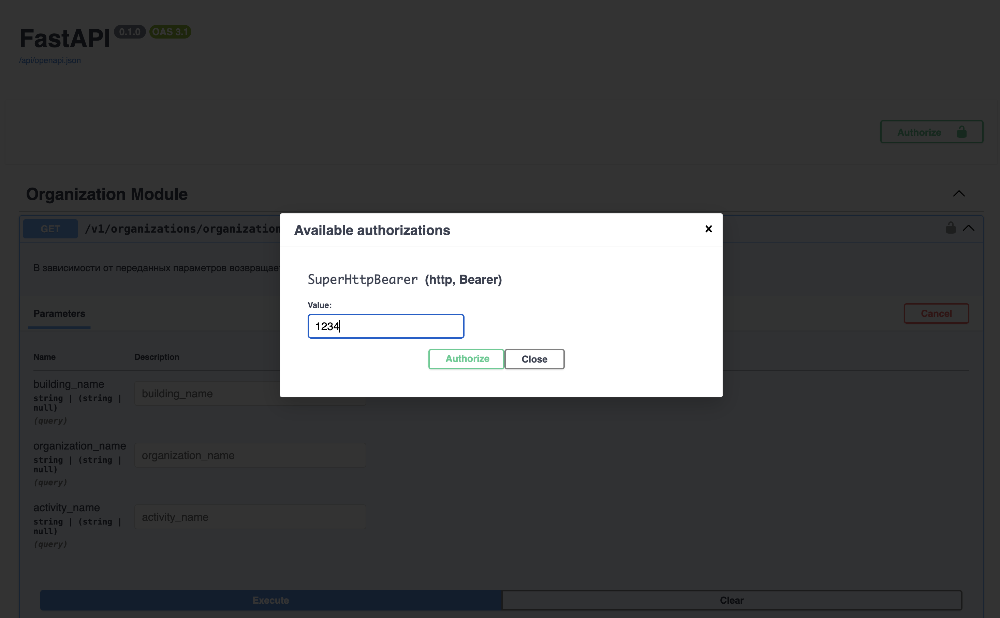

# Тестовое задание 
## Запуск 
    1. make start_with_fixtures - запускает приложение с загрузкой фикстур
    2. make only_start - запускает приложение без дополнительных фикстур 
    3. make stop - останавливает приложение
Миграции применяются автоматически !
## Документация 
    1. /docs/ - swagger 
    2. /redoc/ - redoc 
## Авторизация 
Просто написать статический API ключ в данное поле без приставки Bearer 

## Фикстуры 
Фикстуры лежат по адресу api/fixtures
## Примеры запросов 
    1. Для /v1/organizations/organization - можно вставить только 1 query param, если не вставить ничего, то мы просто будем искать все организации 
    2. /v1/organizations/organization/search-by-geo  -  query param содержат текущую широту и долготу, а также радиус поиска в метрах. Пример входных данный для нахождения организаций:
    Входные данные:
        Широта: 55.7500
        Долгота: 37.6100
        Радиус: 2000 метров (2 км)

